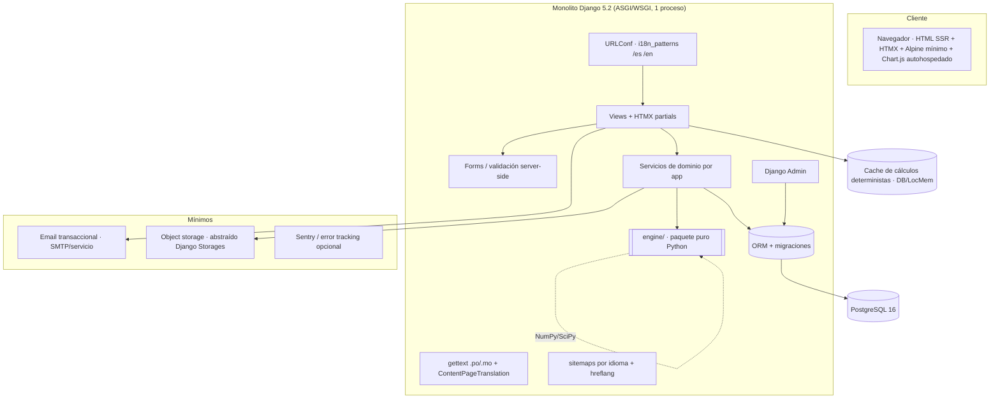
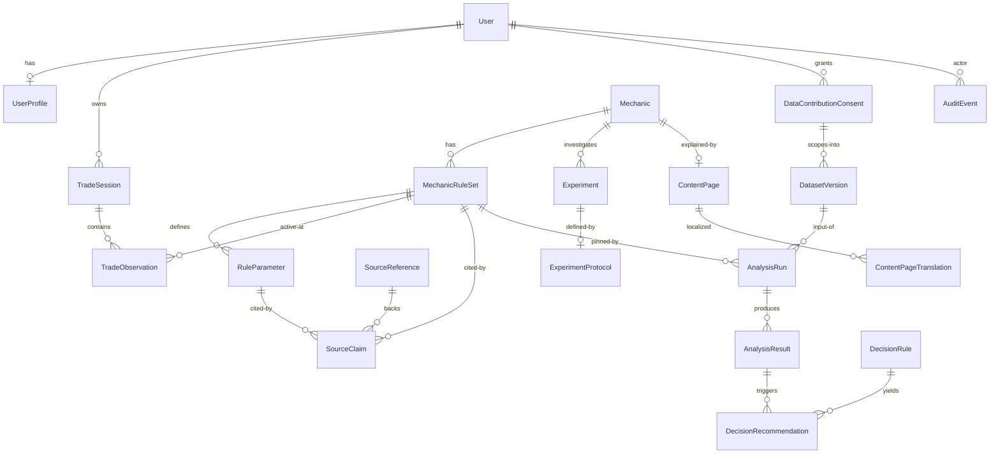

# Plan de implementación — Pogo-lab (Mechanics Lab + Decision Planner)

> **Contexto.** El directorio `Pogo-lab` está **vacío** (sin git, sin código). Este es un proyecto *greenfield*. El
> objetivo de esta ejecución es entregar un **plan técnico y de producto completo, verificable y listo para
> implementación** del MVP: una plataforma web global que explica cómo funcionan realmente las mecánicas de
> Pokémon GO (matemáticas + fuentes trazables + datos empíricos) y convierte esas probabilidades en decisiones
> prácticas. El MVP valida el ciclo **Entender → Calcular → Registrar → Analizar → Decidir** con **una** familia de
> problemas: **intercambios, IV y Pokémon Lucky**.
>
> **Toolchain verificado en el entorno:** Python 3.13.12, `uv` 0.10.11, Docker 29.1.3, Node 24.15. No hay `psql`
> local (Postgres irá vía Docker) ni Poetry (usaremos `uv`).
>
> **Decisiones del usuario para este plan:** (1) **Alcance completo M0–M7** — el dataset comunitario entra en el
> MVP. (2) **Despliegue**: se documenta como recomendación reversible (PaaS gestionado por defecto), a decidir
> antes de M7.
>
> **Nota de integridad de datos que atraviesa todo el plan:** los pisos de IV por nivel de amistad y por Lucky son
> **hechos comunitarios**, no oficiales. El plan los modela como parámetros de *ruleset* versionados con procedencia
> (`SourceClaim`) y nivel de confianza; los valores numéricos exactos se **verifican contra datamining comunitario
> en el momento del seed**, no se hardcodean de memoria. Presentarlos como verdad oficial contradiría la tesis de
> credibilidad del producto.

---

## A. Resumen ejecutivo

- **Producto.** Pogo-lab: laboratorio de mecánicas + planificador de decisiones para Pokémon GO. Web global,
  server-rendered, bilingüe (es/en) desde el día 1, preparada para pt.
- **Usuario primario.** Jugador intermedio/avanzado que intercambia con frecuencia, busca IV perfectos (hundos),
  quiere entender probabilidades reales y está dispuesto a registrar resultados.
- **Problema.** La comunidad repite tasas y afirmaciones ("los Lucky tienen piso 12", "esto está buggeado") sin una
  herramienta que separe **lo oficial**, **lo aceptado por la comunidad**, **lo inferido** y **lo que estamos
  midiendo**, ni que combine explicación + calculadora + seguimiento personal + análisis estadístico honesto.
- **Wedge.** Intercambios/IV/Lucky: una familia con matemática cerrada (uniforme discreta), decisiones claras y
  público motivado a registrar datos.
- **Propuesta de valor.** *Entiende cómo funciona realmente Pokémon GO y usa esos datos para decidir mejor.*
- **Alcance MVP (elegido: completo M0–M7).** Landing; biblioteca de mecánicas (IV post-intercambio); calculadora
  pública compartible; registro de sesiones/observaciones (manual + CSV, sin OCR); dashboard personal; análisis
  estadístico honesto; recomendaciones deterministas; dataset comunitario opt-in con consentimiento/anonimización;
  fuentes con procedencia; i18n es/en; SEO técnico.
- **No alcance.** Ver §5 de la spec: sin integración con la cuenta del juego, sin APIs privadas, sin scraping,
  sin OCR obligatorio, sin app nativa, sin PvP/raids/inventario, sin ML/LLM en runtime, sin pagos.
- **Arquitectura recomendada.** **Monolito modular Django 5.2 LTS + PostgreSQL 16**, templates SSR + **HTMX** +
  Alpine mínimo, con un **motor matemático/estadístico puro en Python** (`engine/`, sin dependencias de Django,
  100% testeable y reproducible). Sin colas ni Redis en el MVP; análisis síncrono con caché determinista y un punto
  de extensión asíncrono documentado.
- **Riesgo principal.** **Honestidad estadística y de procedencia**: el producto vive o muere por *no* afirmar bugs
  ni presentar datos comunitarios sesgados como evidencia definitiva. La mitigación es de diseño (umbrales mínimos,
  métodos exactos, tamaños de efecto, lenguaje "compatible con" vs "demostrado", separación estricta
  oficial/comunidad/inferido) y está incrustada en el motor y en la UI, no delegada al criterio del redactor.

---

## B. Supuestos

| # | Supuesto | Evidencia | Impacto | Riesgo | Cómo validarlo |
|---|----------|-----------|---------|--------|----------------|
| S1 | El modelo comunitario de IV post-trade es **re-roll uniforme en `[f,15]`** (no clamping/pico en el piso) | Datamining/consenso comunitario; distinción explícita pedida por la spec | Alto (define todo el motor y la página "un piso no comprime") | Medio | Verificar contra GAME_MASTER / Silph Road / GamePress al seed; marcar como `SourceClaim` tipo *community* |
| S2 | El **piso de trade normal depende del nivel de amistad** (Good/Great/Ultra/Best → pisos crecientes); **Lucky=12** lo sobrescribe | Consenso comunitario; §4.3 pide "categoría de amistad", §15 pide "piso por categoría" | Alto (estructura del ruleset, seed, contenido) | Alto (valores exactos son comunitarios) | Modelar mapeo amistad→f como parámetros; **verificar los números al seed**, no hardcodear de memoria |
| S3 | Att/Def/HP son **independientes** bajo el modelo | Supuesto del modelo comunitario | Medio (P(hundo)=(1/k)³) | Medio | Declararlo como *supuesto con procedencia*; la parte empírica lo **prueba**, no lo asume como hecho |
| S4 | El volumen de datos del MVP es pequeño (miles, no millones, de observaciones) | Producto nuevo, nicho | Alto (justifica análisis **síncrono** sin Celery/Redis) | Bajo | Métrica de volumen; punto de extensión asíncrono listo si se supera umbral |
| S5 | **Django templates + HTMX** cubren toda la interactividad (calculadora, entrada rápida, dashboard) sin SPA | §7 lo prefiere explícitamente | Alto | Bajo | Spike de calculadora HTMX en M3; si friccionara, Alpine puntual |
| S6 | **CSS: Tailwind vía standalone CLI** (binario, sin cadena Node en runtime) | §7 permite Tailwind "si mejora productividad sin complicar el build" | Bajo | Bajo | Si el binario molesta, fallback a CSS propio con tokens; reversible |
| S7 | **Auth propia de Django + django-allauth** (email+password, verificación de email, reset), **sin** social login en MVP | §7 y §10 | Medio | Bajo | allauth es estándar; social login se añade luego sin migración |
| S8 | **Deploy PaaS gestionado** (Fly.io/Railway/Render) + Postgres administrado | Elección del usuario ("recomiéndame") | Medio | Bajo | Decisión reversible antes de M7; contenedor OCI portable a VPS |
| S9 | **CSV** es el formato de import/export (no XLSX) | §4.4/§13; simplicidad y anti-injection | Bajo | Bajo | Documentar plantilla CSV; sanitizar contra spreadsheet injection al exportar |
| S10 | **Chart.js autohospedado** para gráficos, con tabla/`aria` de respaldo | §7/§11 | Bajo | Bajo | Cargar diferido; verificar accesibilidad |
| S11 | El país agregado es el único dato geográfico; **sin ubicación precisa, sin nombre de entrenador** | §4.8/§10 | Medio (privacidad) | Bajo | Revisión de privacidad; minimización de PII |
| S12 | **Sin OCR** en MVP; interfaz preparada para incorporarlo | §4.4 | Bajo | Bajo | Spike opcional solo si reduce fricción sin elevar riesgo |

---

## C. Preguntas bloqueantes

**No hay preguntas realmente bloqueantes pendientes.** Las dos decisiones que podían cambiar el build
(apetito de recorte del MVP y objetivo de despliegue) ya fueron resueltas por el usuario: **alcance completo
M0–M7** y **despliegue como recomendación reversible (PaaS por defecto)**. El resto de decisiones (§19) se resuelven
en este plan con supuestos razonables y reversibles (tabla §B). Se puede iniciar la implementación de M0/M1.

Dos **checkpoints no bloqueantes** que requieren verificación humana antes de publicar, no antes de codificar:

1. **Revisión legal/marca** del disclaimer de no afiliación, licencias y política de privacidad (antes de beta, §I).
2. **Verificación de los valores comunitarios** de pisos por amistad contra datamining, al hacer el seed (S2).

---

## D. Arquitectura

**Monolito modular Django.** Un proyecto, varias apps con límites de dominio claros, más un **paquete puro
`engine/`** (sin Django) que concentra toda la matemática/estadística/decisiones y es la pieza reutilizable y
100% testeable.



### Componentes

- **`config/`** — proyecto Django: `settings/` por entorno (base/dev/prod/test), `urls.py` raíz con
  `i18n_patterns`, `asgi.py`/`wsgi.py`.
- **`engine/`** — paquete puro Python (sin imports de Django): `probability.py`, `intervals.py`, `stat_tests.py`,
  `decisions.py`, `rulesets.py` (schemas de parámetros vía dataclasses/pydantic), `versioning.py`. Es la frontera
  que garantiza reproducibilidad, tests de propiedad y reutilización entre idiomas.
- **Apps de dominio** (§D-límites): `core`, `accounts`, `mechanics`, `sources`, `calculators`, `trades`,
  `analysis`, `decisions`, `contributions`, `experiments`, `content`, `audit`. (Se evita el nombre `statistics`
  porque colisiona con el módulo stdlib de Python → app `analysis`.)
- **Cache determinista** — cálculos de calculadora y `AnalysisRun` cacheados por *hash* de (inputs + versión de
  ruleset + versión de algoritmo). Backend LocMem en dev, tabla de DB o el mismo Postgres en prod (sin Redis).
- **Sin cola/broker en el MVP.** El recálculo de agregados y análisis se hace síncrono (datos pequeños, S4) o vía
  **management command** idempotente disparado por señal/cron. Punto de extensión documentado para
  `django-q2`/Celery si el volumen lo exige (§11).

### Flujo de datos (Entender → Calcular → Registrar → Analizar → Decidir)

1. **Entender.** `content` + `mechanics` + `sources` renderizan la página de mecánica con explicación, reglas
   vigentes, supuestos, fórmula, fuentes (con tipo/procedencia/confianza) y changelog.
2. **Calcular.** `calculators` toma inputs (amistad→f, tipo, n, objetivo, confianza) → llama `engine.probability`
   → resultado SSR + explicación en lenguaje natural + URL compartible determinista.
3. **Registrar.** `trades`: `TradeSession` + `TradeObservation` (manual rápido, por lotes, import CSV). Validación
   server-side y estado de observación (draft/valid/excluded/suspicious/duplicate/deleted).
4. **Analizar.** `analysis` construye un `AnalysisRun` (filtros: Lucky/ruleset/periodo; versión de algoritmo;
   semilla) → llama `engine.stat_tests`/`intervals` → `AnalysisResult` reproducible.
5. **Decidir.** `decisions` evalúa reglas **deterministas** sobre el `AnalysisResult` → `DecisionRecommendation`
   trazables a reglas, con explicación (nunca generadas por LLM en runtime).
6. **Contribuir (opt-in).** `contributions` toma observaciones con consentimiento explícito → anonimiza →
   materializa `DatasetVersion` → dashboard comunitario con advertencias de sesgo de selección.

### Límites de dominio (bounded contexts)

- **Conocimiento/procedencia:** `mechanics` + `sources` (reglas, parámetros, claims, niveles de evidencia).
- **Cálculo público:** `calculators` (stateless salvo caché; no requiere login).
- **Datos privados del usuario:** `trades` + `accounts` (propiedad estricta por usuario).
- **Inferencia:** `analysis` + `engine.stat_tests` (reproducible, versionada).
- **Acción:** `decisions` (reglas versionadas).
- **Bien común:** `contributions` + `experiments` (consentimiento, anonimización, datasets públicos).
- **Transversal:** `content`/i18n, `audit`, `core`.

### Dependencias y decisiones (detalle en §19)

- Django 5.2 LTS · PostgreSQL 16 · HTMX + Alpine mínimo · Tailwind standalone CLI · NumPy/SciPy (Pandas solo si
  aporta) · Chart.js autohospedado · `uv` · Ruff + mypy/django-stubs + pre-commit · pytest/pytest-django/hypothesis
  /Playwright · GitHub Actions · deploy contenedor OCI + Postgres administrado (PaaS por defecto).

---

## E. Modelo de datos



### Convenciones globales

- **PK** `BigAutoField`. **Timestamps** `created_at`/`updated_at` en todo modelo (mixin `TimestampedModel` en
  `core`). **TZ**: almacenar en UTC (`USE_TZ=True`); el input del usuario captura zona/offset donde importe.
- **Soft delete** solo donde hay linaje/auditoría (`TradeObservation`, contribuciones). Resto: borrado duro.
- **Provenance**: entidades de conocimiento (`RuleParameter`, `MechanicRuleSet`) enlazan `SourceClaim`.
- **Versionado**: `MechanicRuleSet` y `DatasetVersion` y el `algorithm_version` del engine son **inmutables al
  publicar**; los cambios crean nuevas versiones con `effective_from/to`.
- **Índices**: claves foráneas + los campos de filtro caliente (`TradeObservation(owner, is_lucky, ruleset,
  observed_at, state)`), únicos de deduplicación e `hreflang`.

### Entidades (propósito · campos clave · constraints · privacidad · versionado)

- **User** — auth estándar Django (o modelo custom `accounts.User` con email como login). *Privacidad:* email es
  PII; nunca en logs. *Retención:* eliminación de cuenta borra/anonimiza en cascada.
- **UserProfile** — `user(1:1)`, `locale`, `country(opcional, agregado)`, `default_contribution_optin(bool)`,
  `display_prefs`. Sin nombre de entrenador.
- **Mechanic** — `slug(unique)`, `key(ej. "trade_iv")`, `status`, `current_ruleset(fk)`. Catálogo de familias.
- **MechanicRuleSet** — `mechanic(fk)`, `version(int)`, `name`, `effective_from`, `effective_to(null)`,
  `is_published(bool)`, `confidence_level`, `notes`. *Constraint:* único `(mechanic, version)`; no editable si
  `is_published`. Es la unidad de **versionado de reglas**.
- **RuleParameter** — `ruleset(fk)`, `key(ej. "floor.friendship.best", "floor.lucky")`, `value(JSON/num)`,
  `data_type`, `unit`. Aquí viven los **pisos por amistad** y **Lucky=12** como *datos configurables*, no código.
- **SourceReference** — `title`, `url`, `source_type(oficial|community_research|datamining|inference|internal_
  hypothesis)`, `author_org`, `published_at`, `retrieved_at`, `status(vigente|en_revision|obsoleta|contradicha)`,
  `effective_from/to`, `notes`. Distingue oficial vs comunidad vs inferido.
- **SourceClaim** — `source(fk)`, `ruleset(fk,null)`, `parameter(fk,null)`, `scope`, `quote_summary`,
  `confidence_level`. Vincula afirmación ↔ evidencia. *Los pisos por amistad se guardan aquí como claims citados.*
- **Experiment / ExperimentProtocol** — `mechanic(fk)`, `hypothesis`, `status`, `min_sample`, `method_notes`,
  `dataset_version(fk,null)`. Define qué se está intentando medir.
- **TradeSession** — `owner(fk)`, `started_at`, `label`, `default_friendship`, `default_trade_type`, `notes`.
- **TradeObservation** — `session(fk)`, `owner(fk, denormalizado para filtros)`, `observed_at`, `tz_offset`,
  `friendship_level`, `trade_type(normal|lucky|lucky_guaranteed)`, `is_lucky(bool)`, `lucky_guaranteed(bool/null)`,
  `atk 0..15`, `def 0..15`, `hp 0..15`, `species(opcional)`, `special_trade(bool/null)`, `oldest_age_bucket(opc)`,
  `event_context(opc)`, `app_version(opc)`, `input_method(manual|batch|csv)`, `ruleset(fk, vigente al registrar)`,
  `state(draft|valid|excluded|suspicious|duplicate|deleted)`, `exclusion_reason(opc)`, `contribution_optin(bool)`,
  `dedup_hash`, `notes(privado)`. *Constraints:* `0<=iv<=15`; coherencia piso↔resultado por `ruleset`;
  `is_lucky` consistente con `trade_type`. *Índices:* `(owner,is_lucky,ruleset,observed_at)`, `dedup_hash`.
  *Privacidad:* `notes` nunca sale a contribuciones.
- **DataContributionConsent** — `user(fk)`, `scope`, `consent_text_version`, `granted_at`, `revoked_at(null)`,
  `is_active`. Modela consentimiento **explícito y revocable** con versión del texto.
- **DatasetVersion** — `number(int)`, `built_at`, `criteria(JSON: filtros/umbral)`, `min_sample_met(bool)`,
  `row_count`, `checksum`, `is_public(bool)`, `pipeline_version`. **Inmutable**; snapshot anonimizado.
- **AnalysisRun** — `dataset_version(fk,null)`/`owner(fk,null para análisis personal)`, `filters(JSON)`,
  `ruleset(fk)`, `algorithm_version`, `method_params(JSON)`, `random_seed`, `code_sha`, `created_at`. Clave de
  **reproducibilidad**.
- **AnalysisResult** — `run(fk)`, `metric_key`, `payload(JSON: estimador, IC, p-valor exacto, tamaño de efecto,
  método usado, n, esperados_min)`. No se almacenan derivados triviales salvo por reproducibilidad/rendimiento.
- **DecisionRule** — `key`, `version`, `condition_spec(JSON declarativo)`, `message_key(i18n)`, `severity`,
  `is_active`. Determinista y versionada.
- **DecisionRecommendation** — `analysis_result(fk)`/`context`, `rule(fk)`, `params(JSON)`, `created_at`. Trazable
  a la regla que la produjo.
- **ContentPage** — `slug`, `mechanic(fk,null)`, `page_type`, `status`, `updated_at`, `review_date`.
- **ContentPageTranslation** — `page(fk)`, `locale`, `title`, `body`, `seo_title`, `seo_description`,
  `og_fields(JSON)`, `is_published`. *Constraint:* único `(page, locale)`. Contenido **indexable** por idioma.
- **AuditEvent** — `actor(fk,null)`, `verb`, `target_type/id`, `metadata(JSON, sin PII)`, `correlation_id`,
  `created_at`. Auditoría de acciones sensibles (invalidación de observaciones, recálculos, cambios de ruleset).

*Justificación de no almacenar derivados:* probabilidades de la calculadora se recalculan (baratas) y se cachean
por hash; solo `AnalysisResult` se persiste, porque su valor es la **reproducibilidad y auditoría** de la inferencia.

---

## F. Motor matemático y estadístico (`engine/`)

Paquete puro Python, sin dependencias de Django. Todas las funciones son deterministas (la simulación recibe
`seed`). Probabilidades exactas con `fractions.Fraction` donde importa; floats solo en la frontera de presentación.

### Modelo teórico (`engine/probability.py`)

Para piso `f` (0≤f≤15), valores enteros **uniformes** en `[f,15]` (modelo re-roll, **no** clamping):

- `possible_values(f) -> int` = `16 - f` = k
- `p_specific_iv(f) -> Fraction` = `1/k`  (cualquier valor concreto ≥ f)
- `p_stat_at_least(f, t) -> Fraction` = `(16 - t)/k` para `t ≥ f` (objetivo "stat individual ≥ t")
- `p_hundo(f) -> Fraction` = `(1/k)**3`  (supone independencia Att/Def/HP — **S3**, declarada como supuesto)
- `iv_sum_distribution(f) -> dict[int, Fraction]` = convolución de tres uniformes `[f,15]` (soporte `3f..45`);
  Σ = 1 exacto
- `p_sum_at_least(f, s) -> Fraction` = cola de la distribución de suma (objetivo "IV total mínimo")
- `p_at_least_one(p, n) -> float` = `1 - (1-p)**n`
- `p_zero(p, n) -> float` = `(1-p)**n`
- `expected_successes(p, n) -> float` = `n*p`
- `outcome_distribution(p, n) -> list[float]` = binomial(n,p) (nº de éxitos), útil cuando aporta
- `trades_for_confidence(p, c) -> int` = `ceil(ln(1-c)/ln(1-p))` (menor n con `1-(1-p)**n ≥ c`)

**`per_trade_success_prob(f, target)`** mapea el objetivo del usuario a `p`:
`hundo → p_hundo(f)`; `stat_min(t) → p_stat_at_least(f,t)`; `sum_min(s) → p_sum_at_least(f,s)`;
`at_least_one_success` opera sobre `p` ya calculado a lo largo de n. El **piso `f`** proviene del `RuleParameter`
según `friendship_level`/`trade_type` (Lucky sobrescribe con f=12), no del código.

### Intervalos de confianza (`engine/intervals.py`)

- `wilson_interval(successes, n, conf) -> (lo, hi)` — **por defecto** en la UI (buena cobertura con n pequeño y p
  extrema, siempre en [0,1]).
- `clopper_pearson_interval(successes, n, conf) -> (lo, hi)` — exacto/conservador vía `scipy.stats.beta.ppf`;
  disponible para el modo "estricto".
- `beta_binomial_credible(successes, n, cred, prior=(1,1)) -> (lo, hi)` — **opcional** (v1.1): intervalo creíble
  bayesiano simple para comunicar "compatible con" en muestras pequeñas.

*Justificación (§4.6):* se descarta **Wald** (cobertura pésima con p≈0 y n chico, sale de [0,1]). Wilson para
mostrar; Clopper–Pearson cuando se requiera garantía exacta. Bayesiano solo si añade claridad, no por defecto.

### Pruebas estadísticas (`engine/stat_tests.py`)

- `exact_binomial_test(successes, n, p0) -> Result` (`scipy.stats.binomtest`, bilateral) — **hundos**: la esperanza
  es minúscula (p≈(1/4)³ Lucky, (1/15)³ estándar), por lo que **chi-cuadrado es inválido** → binomial exacta.
- `uniformity_test(counts, expected_probs, method="auto", seed) -> Result` — bondad de ajuste por stat:
  usa **chi-cuadrado solo si todos los esperados ≥ 5**; si no, **p-valor por Monte Carlo** (simular multinomial bajo
  H0, `seed` fijo). Devuelve `stat, p_value, effect_size(Cramér's V), method_used, min_expected, n`.
- `independence_test(pairs, method="auto", seed) -> Result` — independencia por pares Att/Def/HP (G-test o MC),
  con **advertencia de comparaciones múltiples** (Holm) incorporada en el payload.
- Helpers de **tamaño de efecto** y de **umbral mínimo** (`min_sample_for(metric)`): las inferencias no se muestran
  bajo el umbral; en su lugar, mensaje "muestra insuficiente".

### Reglas de decisión (`engine/decisions.py`)

Función pura `evaluate(analysis: AnalysisResult, context) -> list[Recommendation]`. Reglas **deterministas y
versionadas** (`condition_spec` declarativo), p. ej.: `insufficient_sample`, `separate_lucky_and_normal`,
`mixed_rulesets_or_periods`, `compatible_with_model`, `trades_needed_for_confidence`, `small_effect_more_data`,
`no_anomaly_conclusion`. Cada recomendación referencia `rule.key + version` y un `message_key` i18n. **Nunca LLM.**

### Casos límite (tests obligatorios)

`f=15` (k=1, p_hundo=1); `f=0`; `n=0` y `n` grande; `successes=0` y `successes=n`; `c→1` (n→∞ controlado);
`p=0`/`p=1` (evitar `log(0)`); suma en extremos del soporte; esperados=0 en celdas de uniformidad; n bajo umbral.

### Lenguaje de comunicación (§4.5/§4.6)

Nunca "el juego está manipulado" ni "hay un bug" a partir de una diferencia descriptiva o un p-valor. Se distingue
**"compatible con el modelo"** de **"modelo demostrado"**; se muestran **intervalos** y **tamaño de efecto**, no
falsa precisión; se advierte sobre **múltiples comparaciones** y **sesgo de selección** del dataset comunitario.

### Reproducibilidad

Cada `AnalysisRun` fija `dataset_version + ruleset.version + algorithm_version + random_seed + code_sha`. Reejecutar
con esas claves reproduce bit a bit. **Fixtures pequeñas con valores calculados a mano** (no snapshots opacos) validan
la matemática; property-based (Hypothesis) valida invariantes (prob∈[0,1], Σdist=1, monotonía en n, exacto≈MC).

---

## G. UX y navegación

**Mobile-first**, SSR, HTMX para interactividad parcial (recalcular calculadora, entrada rápida por lotes, cargar
gráficos diferidos). Tres niveles de accesibilidad intelectual en cada análisis: **(1) respuesta directa →
(2) calculadora/visualización → (3) metodología**.

### Sitemap y rutas (con `i18n_patterns`; `{lang}` ∈ es|en, pt preparado)

```text
/{lang}/                                  Landing (3 CTA)
/{lang}/mecanicas/                        Índice de mecánicas
/{lang}/mecanicas/iv-en-intercambios/     Página de mecánica (explicación+reglas+calc+evidencia+changelog)
/{lang}/calculadora/                       Calculadora pública (params en query → SSR + share URL)
/{lang}/guias/{slug}/                      Páginas de contenido evergreen (§15)
/{lang}/metodologia/                       Metodología estadística
/{lang}/fuentes/                           Fuentes y niveles de evidencia
/{lang}/dataset/                           Dashboard comunitario + descarga (si min_sample_met)
/{lang}/cuenta/  (auth)                     Registro/login/reset (allauth), perfil, exportar/eliminar datos
/{lang}/sesiones/ (auth)                    Lista/crear TradeSession
/{lang}/sesiones/{id}/ (auth)              Detalle + entrada rápida + import CSV
/{lang}/panel/ (auth)                       Dashboard personal (distribuciones, IC, recomendaciones)
/{lang}/contribuir/ (auth)                  Consentimiento opt-in / revocación
/{lang}/legal/{privacidad|no-afiliacion|correcciones|terminos|licencia-dataset}/
/admin/                                     Django Admin (staff)
/sitemap-{lang}.xml · /robots.txt · /healthz
```

### Flujos clave (10 E2E de §13)

Visitante calcula probabilidad → crea cuenta → registra sesión → ve panel → contribuye opt-in → revoca →
(admin invalida observación) → recálculo del agregado → cambia idioma sin perder contexto → URL compartida
reproduce el cálculo.

### Wireframes textuales (mobile-first)

- **Landing:** hero con propuesta de valor + disclaimer de no afiliación visible; 3 tarjetas CTA
  ("Calcular mis probabilidades" · "Registrar mis intercambios" · "Ver qué muestran los datos").
- **Página de mecánica:** [Respuesta directa] → [Calculadora integrada HTMX] → [Reglas vigentes con fecha/confianza]
  → [Evidencia empírica disponible] → [Fuentes por tipo] → [Limitaciones] → [Changelog].
- **Calculadora:** formulario (amistad, tipo, objetivo, n, confianza) a la izquierda; resultado a la derecha
  (prob/intercambio, acumulada, esperados, P(0), n para confianza, explicación en lenguaje natural, botón
  "Copiar enlace"). Recalcula con HTMX sin recargar; URL refleja el estado.
- **Entrada rápida:** teclado numérico móvil, Atk/Def/HP en una fila, toggles Lucky/garantizado, "guardar y
  siguiente"; modo por lotes; import CSV con vista previa y errores por fila.
- **Panel personal:** tarjetas de totales (Lucky vs normal separados) → distribuciones (Chart.js, con tabla
  alternativa) → tasa observada vs esperada con IC → recomendaciones → advertencias de calidad de datos.

### Estados vacíos / errores / i18n

- **Vacíos:** "Aún no registras intercambios — empieza aquí" con CTA; panel sin datos muestra la explicación teórica.
- **Umbral no alcanzado:** "Tu muestra todavía es insuficiente para evaluar uniformidad de forma fiable."
- **Errores:** mensajes claros y accionables (validación por campo/fila); nunca stack traces.
- **i18n:** cambio de idioma preserva la ruta equivalente y el estado de query; formatos de fecha/número por locale;
  hreflang entre variantes.

---

## H. Contratos (servicios internos e I/O)

Servicios de dominio (Python) que envuelven `engine/` y el ORM. Firmas orientativas:

### `calculators`

- `compute_scenario(inputs: CalcInput) -> CalcResult`
  - `CalcInput{friendship_level, trade_type, floor_override?, n, target{kind, threshold?}, confidence}`
  - `CalcResult{p_per_trade, p_cumulative, expected_successes, p_zero, distribution?, trades_for_confidence,
    assumptions[], ruleset_version, sources[], explanation_i18n_key, params}`
- `encode_share_url(inputs) / decode_share_url(query) -> CalcInput` (determinista, canónico).

### `trades`

- `create_session(owner, data) -> TradeSession`
- `add_observation(session, data) -> TradeObservation` (valida IV∈[0,15], coherencia piso↔ruleset, Lucky)
- `bulk_add(session, rows) -> BatchResult{created[], errors[]}`
- `import_csv(session, file) -> ImportReport{rows_ok, rows_error[], dedup_skipped}`
- `set_observation_state(obs, state, reason, actor) -> TradeObservation` (emite `AuditEvent`)

### `analysis`

- `run_personal_analysis(owner, filters) -> AnalysisRun` → persiste `AnalysisResult[]`
- `run_dataset_analysis(dataset_version, filters) -> AnalysisRun`
- Cada run llama `engine.stat_tests`/`intervals`; separa **obligatoriamente Lucky/normal** y por **ruleset/periodo**.

### `decisions`

- `recommend(analysis_run) -> list[DecisionRecommendation]` (delega en `engine.decisions.evaluate`)

### `contributions`

- `grant_consent(user, scope, text_version) / revoke_consent(consent)`
- `build_dataset_version(criteria) -> DatasetVersion` (anonimiza: excluye `notes`, sin trainer/ubicación; país
  agregado; `dedup_hash`; aplica `min_sample`; marca `is_public`)
- `export_public_dataset(version) -> CSV` (sanitizado anti spreadsheet-injection)

### `sources` / `mechanics`

- `publish_ruleset(ruleset) -> None` (congela; valida parámetros contra schema del engine)
- `resolve_active_ruleset(mechanic, at_datetime) -> MechanicRuleSet` (por `effective_from/to`)

### Eventos / auditoría

- `AuditEvent` en: cambio de estado de observación, publicación de ruleset, build de dataset, revocación de
  consentimiento, recálculo. Incluyen `correlation_id`.

### Imports/exports

- **Import:** CSV con cabecera documentada (plantilla en `/docs/csv_template.csv`); validación por fila; límite de
  tamaño/filas; sin fórmulas.
- **Export:** CSV del usuario (sus datos) y CSV público del dataset; celdas que empiezan por `= + - @` se
  prefijan con `'` (anti-injection).

---

## I. Seguridad, privacidad y cumplimiento

### Threat model proporcional

Activos: PII mínima (email, país opcional), datos privados de intercambios, integridad del dataset público.
Amenazas: XSS, CSRF, inyección, carga maliciosa de CSV, spam/automatización de contribuciones, envenenamiento del
dataset, exfiltración de PII en logs. Mitigaciones proporcionadas (no infraestructura empresarial).

### Controles

- **Auth:** django-allauth (email+password, verificación de email, reset seguro). Sesiones seguras, cookies
  `HttpOnly`/`Secure`/`SameSite`.
- **CSRF** middleware de Django en todos los POST/HTMX. **Validación server-side** siempre (no confiar en cliente).
- **Escaping** por defecto de templates Django; **CSP** estricta (sin inline JS salvo hashes; Chart.js/HTMX
  autohospedados). **Rate limiting** en login/registro/contribución (django-ratelimit).
- **CSV:** límite de tamaño/filas, validación de tipos, cuarentena de errores; **anti spreadsheet-injection** al
  exportar.
- **Privacidad/minimización:** sin nombre de entrenador, sin ubicación precisa (solo país agregado), `notes`
  privadas nunca se agregan. **Logs sin PII** (correlation_id, no email).
- **Separación privado/público:** el dataset público es un **snapshot anonimizado inmutable** (`DatasetVersion`),
  no una vista sobre datos vivos; la revocación excluye de builds futuros.
- **Consentimiento:** explícito, con versión de texto, revocable; auditado.
- **Cuenta:** exportación de datos (CSV) y **eliminación de cuenta** (borra/anonimiza en cascada).
- **Secretos:** variables de entorno (`django-environ`), nunca en repo; `.env.example` sin valores reales.
- **Dependencias auditadas** (`uv`/pip-audit en CI). **Admin** con permisos por rol y 2FA opcional para staff.
- **Moderación de contribuciones:** estados `suspicious/duplicate`, umbral mínimo antes de publicar, marca de
  datasets sospechosos.

### Legal / IP (requiere revisión profesional — **no es asesoría concluyente**)

- **Sin** logos/sprites/ilustraciones/recursos oficiales; **sin** dominio que implique afiliación; **sin** APIs
  privadas ni automatización del juego.
- Incluir: **disclaimer de no afiliación**, política de privacidad, términos de uso, consentimiento de
  contribución, **licencia del dataset** (p. ej. CC BY o CC0 a decidir), **licencia del código**, proceso de
  retiro de datos, **política de correcciones metodológicas**.
- **Marcar para revisión legal antes de beta:** nombre/marca, licencia del dataset, textos de privacidad/ToS,
  uso de nombres de especies (marcas de terceros).

---

## J. Estrategia de pruebas

**Pirámide:** base ancha de unitarias del `engine/` (matemática) + property-based; capa media de integración
(servicios + ORM + forms); cima estrecha de E2E Playwright de flujos críticos. **Sin snapshots opacos para la
matemática** — fixtures con valores calculados a mano y auditables.

| Nivel | Herramienta | Cobertura mínima |
|---|---|---|
| Unitarias | pytest | fórmulas, distribuciones, acumulado, casos límite, rulesets, recomendaciones, validaciones, serialización, permisos |
| Propiedad | Hypothesis | prob∈[0,1]; monotonía en n; Σdistribución=1; exacto≈simulación; invariantes IV 0..15; reproducibilidad con semilla |
| Integración | pytest-django | crear sesión; alta por lotes; import CSV; consentimiento/revocación; agregación; recálculo al cambiar reglas; export; traducciones |
| E2E | Playwright | los 10 flujos de §13 (visitante calcula → cuenta → sesión → panel → opt-in → revoca → admin invalida → recálculo → cambia idioma → URL compartida reproduce) |

**Fixtures de referencia:** casos con `f`, `n`, objetivo y resultados esperados verificados a mano (p. ej.
Lucky f=12 → k=4, p_hundo=1/64; estándar f=1 → k=15, p_hundo=1/3375). **QA manual:** checklist de accesibilidad
(teclado, contraste, tabla alternativa a gráficos), i18n (es/en, formatos), y honestidad del lenguaje estadístico.

**Gate de CI:** Ruff + mypy + pytest (cobertura del `engine/` alta) en cada PR; Playwright en un job aparte.

---

## K. Roadmap (milestones verticales — alcance completo M0–M7)

> Tamaño relativo en *puntos de complejidad* (XS/S/M/L). Sin fechas falsas. Cada milestone entrega una **demo
> verificable**. "Recortes posibles" = qué soltar si un milestone amenaza el avance.

### M0 — Descubrimiento y decisiones · **S**

- **Objetivo:** fijar stack, dominio y contratos estadísticos antes de escribir producto.
- **Tareas:** ADR-0001 (stack Django/Postgres/HTMX vs alternativas), modelo de dominio (§E), contratos del
  `engine/` (firmas §F), riesgos, criterios de aceptación, mock de navegación (§G).
- **Módulos:** `docs/adr/`, este plan, esqueleto `engine/` (solo firmas + docstrings).
- **Pruebas:** ninguna de producto; revisión de contratos. **Aceptación:** ADRs aprobados; firmas del engine
  acordadas. **Demo:** documento + árbol de repo. **Recortes:** ninguno (es el cimiento).

### M1 — Fundación · **M**

- **Objetivo:** proyecto ejecutable, CI verde, auth, i18n, layout, observabilidad mínima.
- **Historias:** bootstrap `uv` + Django + settings por entorno; Docker Compose Postgres; allauth; `i18n_patterns`
  es/en; layout Tailwind; logging estructurado + `/healthz`; Ruff/mypy/pre-commit; pytest base.
- **Módulos:** `config/`, `core/`, `accounts/`, `.github/workflows/`, `compose.yaml`, `Dockerfile`.
- **Pruebas:** smoke de auth + healthcheck; CI. **Aceptación:** `clonar→instalar→migrar→test→run` en pasos cortos.
  **Demo:** login + cambio de idioma. **Recortes:** verificación de email diferible a M7.

### M2 — Rules & Evidence · **M**

- **Objetivo:** conocimiento versionado con procedencia + admin + contenido base.
- **Historias:** modelos `Mechanic/MechanicRuleSet/RuleParameter/SourceReference/SourceClaim`; publicación inmutable;
  `resolve_active_ruleset`; Django Admin; `ContentPage/ContentPageTranslation`; seed inicial (**verificar pisos
  comunitarios**).
- **Módulos:** `mechanics/`, `sources/`, `content/`, `engine/rulesets.py`.
- **Pruebas:** unitarias de versionado/resolución; integración de admin. **Aceptación:** un ruleset de intercambios
  publicado con claims citados y una página de mecánica renderizada es/en. **Demo:** página de mecánica.
  **Recortes:** número de rulesets seed.

### M3 — Calculadora pública · **M**

- **Objetivo:** motor de probabilidad + calculadora SSR compartible, sin login, SEO es/en.
- **Historias:** `engine/probability.py` completo + tests de propiedad; `calculators.compute_scenario`;
  formulario HTMX; `encode/decode_share_url`; explicación en lenguaje natural; sitemap/hreflang/OG.
- **Módulos:** `calculators/`, `engine/probability.py`, `templates/calculators/`.
- **Pruebas:** unit+property del engine; integración de URL compartida; E2E "visitante calcula" y "URL reproduce".
  **Aceptación:** cálculo correcto para casos de referencia + link compartible reproduce. **Demo:** calculadora.
  **Recortes:** distribución de suma (mostrar solo hundo/acumulada primero).

### M4 — Trade Tracker · **L**

- **Objetivo:** registrar sesiones/observaciones (manual+lotes+CSV) con validación y dashboard básico.
- **Historias:** `TradeSession/TradeObservation`; entrada rápida móvil; import CSV con vista previa; validaciones y
  estados; dashboard básico (totales, Lucky vs normal).
- **Módulos:** `trades/`, `templates/trades/`.
- **Pruebas:** integración de alta/lotes/CSV/validación; E2E "registra sesión" + "ve panel". **Aceptación:**
  importar CSV de ejemplo sin OCR y ver totales separados. **Demo:** sesión + dashboard. **Recortes:** import CSV
  a un fast-follow si la entrada manual ya demuestra valor.

### M5 — Analysis & Decisions · **L**

- **Objetivo:** inferencia honesta reproducible + recomendaciones deterministas.
- **Historias:** `engine/intervals.py` + `stat_tests.py` + `decisions.py`; `AnalysisRun/AnalysisResult`;
  `DecisionRule/Recommendation`; panel con IC, distribuciones, observado vs esperado, advertencias, umbrales.
- **Módulos:** `analysis/`, `decisions/`, `engine/*`.
- **Pruebas:** unit/property de estadística; fixtures a mano; E2E del panel. **Aceptación:** con muestra pequeña
  muestra "compatible/insuficiente" (nunca "bug"); reproducible con semilla. **Demo:** panel con recomendaciones.
  **Recortes:** test de independencia y bayesiano a v1.1.

### M6 — Community Dataset · **L**

- **Objetivo:** contribución opt-in anonimizada, moderación, versionado y dashboard público.
- **Historias:** `DataContributionConsent`; `build_dataset_version` (anonimización + min_sample + dedup);
  moderación (suspicious/duplicate); dashboard comunitario + descarga; advertencia de sesgo de selección.
- **Módulos:** `contributions/`, `experiments/`, `templates/dataset/`.
- **Pruebas:** integración de consentimiento/revocación/build/export; E2E "opt-in" y "revoca". **Aceptación:**
  dataset público solo si `min_sample_met`, sin PII, con metodología y versión. **Demo:** dashboard comunitario.
  **Recortes:** descarga pública diferible; empezar con dashboard de solo lectura.

### M7 — Hardening y beta · **M**

- **Objetivo:** E2E, accesibilidad, rendimiento, seguridad, backup/restore, despliegue, analítica, beta cerrada.
- **Historias:** suite Playwright completa; auditoría a11y/CWV; CSP/rate limit/pip-audit; **decidir hosting**
  (PaaS por defecto) + deploy; backup + **prueba de restore**; métricas de producto; disclaimer/legal revisados.
- **Módulos:** `.github/`, infra, `audit/`, docs.
- **Pruebas:** los 10 E2E; smoke de despliegue; restore verificado. **Aceptación:** DoD (§O) cumplido. **Demo:**
  entorno desplegado + beta cerrada. **Recortes:** ninguno crítico; ajustar profundidad de analítica.

---

## L. File tree propuesto

```text
Pogo-lab/
├─ pyproject.toml            # uv + deps + Ruff/mypy/pytest config
├─ uv.lock
├─ compose.yaml             # Postgres 16 (dev)
├─ Dockerfile               # imagen OCI de despliegue
├─ .env.example             # variables sin secretos reales
├─ manage.py
├─ Makefile / justfile      # bootstrap, test, run, seed, lint
├─ docs/
│  ├─ adr/                  # ADR-0001 stack, ADR-0002 versionado rulesets, ...
│  ├─ methodology.md        # metodología estadística
│  └─ csv_template.csv      # plantilla de import documentada
├─ config/                  # proyecto Django
│  ├─ settings/{base,dev,prod,test}.py
│  ├─ urls.py               # i18n_patterns
│  ├─ asgi.py / wsgi.py
├─ engine/                  # PAQUETE PURO (sin Django) — testeable/reproducible
│  ├─ probability.py  intervals.py  stat_tests.py  decisions.py
│  ├─ rulesets.py           # schemas de parámetros (dataclasses/pydantic)
│  ├─ versioning.py
│  └─ tests/                # unit + property (Hypothesis) con fixtures a mano
├─ apps/
│  ├─ core/                 # mixins (TimestampedModel), utils, cache, healthz
│  ├─ accounts/             # User/UserProfile, allauth, export/eliminación
│  ├─ mechanics/            # Mechanic/RuleSet/RuleParameter + services
│  ├─ sources/              # SourceReference/SourceClaim
│  ├─ calculators/          # compute_scenario, share URL, views HTMX
│  ├─ trades/               # TradeSession/TradeObservation, CSV, dashboard
│  ├─ analysis/             # AnalysisRun/Result (envuelve engine)
│  ├─ decisions/            # DecisionRule/Recommendation
│  ├─ contributions/        # consentimiento, DatasetVersion, anonimización
│  ├─ experiments/          # Experiment/Protocol
│  ├─ content/              # ContentPage/Translation (CMS ligero propio)
│  └─ audit/                # AuditEvent, correlation ids
├─ templates/               # SSR por app + base layout
├─ static/                  # Tailwind build, HTMX, Chart.js (autohospedados)
├─ locale/                  # .po/.mo es/en (pt preparado)
├─ tests/                   # integración + E2E (Playwright)
└─ .github/workflows/       # ci.yml (lint/type/test), e2e.yml, deploy.yml
```

Responsabilidad por carpeta: `engine/` = verdad matemática pura; `apps/*` = dominio Django delgado sobre el engine;
`config/` = wiring; `content/`+`locale/` = i18n editorial + UI; `docs/adr/` = decisiones registradas.

---

## Decisiones resueltas (spec §19)

| # | Decisión | Recomendación | Alternativas / trade-off | Reversibilidad · consecuencia si cambia la hipótesis |
|---|----------|---------------|--------------------------|------------------------------------------------------|
| 1 | Framework/lenguaje (Django templates+HTMX vs SPA / TS+Fastify) | **Django + HTMX** (ADR-0001) | SPA/TS: tipos front-back y realtime, pero pierde SciPy, admin, i18n batteries; más build/deploy | Media. Si se vuelve muy interactivo, añadir islas Alpine/React puntuales sin reescribir backend |
| 2 | Postgres vs SQLite en dev | **Postgres 16 (Docker) en dev** | SQLite: cero setup pero diverge de prod (JSON, constraints, locking) | Alta. Paridad dev/prod evita sorpresas |
| 3 | Auth propia vs paquete | **Django + django-allauth** | Auth manual (más código) / IdP externo (dependencia) | Alta. Social login se añade luego sin migración de datos |
| 4 | CMS propio vs integrado | **CMS ligero propio** (`ContentPage/Translation`) | Wagtail: potente pero pesado para pocas páginas | Media. Migrar a Wagtail posible si el volumen editorial crece |
| 5 | Versionar rulesets | **`MechanicRuleSet` inmutable + `effective_from/to` + versión** | Editar en sitio (rompe reproducibilidad histórica) | Baja/necesaria. Base de la honestidad histórica |
| 6 | Reproducir análisis históricos | **`AnalysisRun` fija dataset+ruleset+algorithm+seed+code_sha** | Recalcular al vuelo (no reproducible) | Baja/necesaria |
| 7 | Separar datos privados/públicos | **Snapshot anonimizado inmutable** (`DatasetVersion`), no vista viva | Vista sobre datos vivos (fuga/inestable) | Media |
| 8 | Consentimiento/revocación | **`DataContributionConsent` con versión de texto, revocable, auditado** | Flag simple en perfil (menos trazable) | Alta |
| 9 | Contenido multilingüe | **gettext (UI) + `ContentPageTranslation` (editorial), indexable** | Traducción cliente (no SEO) | Media |
| 10 | Qué análisis es síncrono | **Todo síncrono en MVP** (datos pequeños, S4) + caché por hash | Async siempre (complejidad prematura) | Alta. Punto de extensión listo |
| 11 | Cuándo async | **Solo si el volumen supera umbral**; entonces `django-q2`/Celery | Introducir cola ya (Redis innecesario) | Alta |
| 12 | Librería estadística | **NumPy + SciPy** (Pandas solo si aporta) | Reimplementar (bugs) / statsmodels (peso) | Alta |
| 13 | Librería de gráficos | **Chart.js autohospedado** + tabla/aria alternativa | Plotly (peso) / D3 (complejidad) | Alta |
| 14 | Formato import/export | **CSV** (anti-injection al exportar) | XLSX (dependencia + riesgo) / JSON (menos amigable) | Alta |
| 15 | Evitar conclusiones engañosas | **Umbrales mínimos + métodos exactos + tamaño de efecto + lenguaje "compatible con"** en el engine | Dejarlo al criterio del redactor (frágil) | Baja/necesaria |
| 16 | Despliegue bajo costo | **Contenedor OCI + Postgres administrado; PaaS por defecto** | VPS+Compose (más ops) | Alta (elección del usuario: reversible antes de M7) |
| 17 | Extensión futura del Planner | **Contratos mínimos** (`ProbabilityModel/ObservationSchema/AnalysisStrategy/DecisionRule`) solo para la 1ª familia, documentar cómo se extienden | Framework genérico ya (sobre-ingeniería) | Alta |
| 18 | Qué recortar | Ver §P; candidatos: distribución de suma, test de independencia, bayesiano, descarga pública del dataset | — | Alta |

---

## Contenido inicial (spec §15)

Cada página indica: intención del usuario · propósito · CTA · datos requeridos · enlaces internos · traducción ·
metadata SEO · criterio de aceptación. Todas es/en (pt preparado), SSR e indexables.

| Página | Intención | CTA · enlace interno clave | Criterio de aceptación |
|---|---|---|---|
| Home | Orientarse | 3 CTA → calculadora / registro / dataset | Comunica valor + no afiliación en <5 s |
| Cómo funcionan los IV en intercambios | Entender | → calculadora, fuentes | Explica re-roll uniforme con fuentes citadas |
| Piso de IV por regla/categoría | Entender pisos | → calculadora | Muestra pisos por amistad + Lucky con confianza/fecha |
| Por qué un piso no comprime valores | Corregir mito | → metodología | Distingue re-roll uniforme (sin pico) vs clamping (pico en f) |
| Probabilidad de hundo por intercambio | Respuesta rápida | → calculadora | Cifra correcta por ruleset + explicación |
| Lucky vs intercambio normal | Comparar | → calculadora | Comparación de escenarios separando Lucky |
| Calculadora de probabilidad acumulada | Aplicar | → registro | Resultado SSR + URL compartible reproduce |
| Cuántos intercambios necesito | Planificar | → calculadora | n para confianza c, correcto |
| Cómo registrar datos correctamente | Aprender flujo | → registro | Guía de entrada + CSV |
| Qué significa "compatible con una tasa" | Alfabetización | → metodología | Distingue "compatible" de "demostrado" |
| Metodología estadística | Profundizar | → fuentes | Fórmulas, métodos, umbrales, reproducibilidad |
| Fuentes y niveles de evidencia | Verificar | → mecánica | Tipos de fuente y estado por claim |
| Dataset comunitario | Explorar datos | → contribuir | Muestra sesgo de selección + versión/fecha |
| Política de correcciones | Confianza | → changelog | Proceso de corrección publicado |
| Privacidad | Confianza | → cuenta | Qué se recoge/no; export/eliminación |
| No afiliación | Legal | — | Disclaimer claro y visible |

---

## M. Secuencia de implementación (PRs pequeños y revisables)

1. **PR-01** Bootstrap: `uv` + Django 5.2 + `config/settings/*` + `.env.example` + `Makefile` + `compose.yaml` (Postgres 16).
2. **PR-02** Calidad: Ruff + mypy/django-stubs + pre-commit + `ci.yml` (lint/type/test) verde.
3. **PR-03** `core`: `TimestampedModel`, `/healthz`, logging estructurado + correlation id.
4. **PR-04** `accounts` + allauth: registro/login/reset; `UserProfile`; export/eliminación (stub).
5. **PR-05** i18n: `i18n_patterns` es/en, `locale/`, selector de idioma, layout base Tailwind.
6. **PR-06** `engine/probability.py` + tests unit/property (fixtures a mano). *(sin Django)*
7. **PR-07** `mechanics`+`sources`+`engine/rulesets.py`: modelos, publicación inmutable, `resolve_active_ruleset`, Admin.
8. **PR-08** Seed inicial: mecánica de intercambios + rulesets + `SourceClaim` (**verificar pisos comunitarios**).
9. **PR-09** `content` CMS ligero: `ContentPage/Translation` + primeras páginas (§15) es/en + SEO base.
10. **PR-10** `calculators`: `compute_scenario` + formulario HTMX + `encode/decode_share_url` + explicación NL.
11. **PR-11** SEO técnico: sitemaps por idioma, hreflang, canonical, OG, robots. E2E "visitante calcula" + "URL reproduce".
12. **PR-12** `trades`: `TradeSession/TradeObservation` + validaciones + estados + entrada rápida móvil.
13. **PR-13** Import CSV + export CSV (anti-injection) + dashboard básico (Lucky vs normal).
14. **PR-14** `engine/intervals.py` + `stat_tests.py` + tests (Wilson/CP/binomial exacta/uniformidad MC).
15. **PR-15** `analysis`: `AnalysisRun/Result` + panel (IC, distribuciones, observado vs esperado, umbrales).
16. **PR-16** `engine/decisions.py` + `decisions`: reglas deterministas + recomendaciones + advertencias.
17. **PR-17** `contributions`: consentimiento/revocación + `build_dataset_version` (anonimización+dedup+min_sample).
18. **PR-18** Dashboard comunitario + descarga pública (si `min_sample_met`) + advertencia de sesgo.
19. **PR-19** `audit` + moderación (suspicious/duplicate) + recálculo idempotente (management command).
20. **PR-20** Hardening: CSP + rate limit + pip-audit; suite Playwright completa; a11y/CWV.
21. **PR-21** Deploy: `Dockerfile` prod + `deploy.yml` + backup + **prueba de restore** + métricas de producto.

---

## N. Riesgos y mitigación

- **Producto:** el wedge no engancha → medir activación calculadora→registro (§18); recorte a "calculadora+contenido" si no convierte.
- **Datos:** valores comunitarios erróneos (pisos) → modelar como claims verificables (S2); nunca oficial.
- **Estadística:** conclusiones engañosas → métodos exactos, umbrales, tamaño de efecto, lenguaje "compatible con" en el engine (no delegado a UI).
- **Legal/IP:** afiliación implícita o uso de recursos oficiales → disclaimer, sin sprites/logos, revisión legal antes de beta.
- **Privacidad:** fuga de PII → minimización, país agregado, logs sin PII, snapshot anonimizado inmutable.
- **Seguridad:** XSS/CSV-injection/spam → CSP, CSRF, rate limit, sanitización de export, moderación.
- **Mantenimiento:** sobre-ingeniería de abstracciones → contratos mínimos solo para la 1ª familia (§19-#17).
- **i18n/SEO:** traducción sin estrategia → contenido indexable por idioma + hreflang + canonical.
- **Adopción/contribución:** dataset sesgado presentado como definitivo → advertencia de sesgo de selección + umbral mínimo antes de publicar.

---

## O. Definición de terminado (checklist para beta)

- [ ] `clonar → uv sync → compose up → migrate → seed → pytest → runserver` en pasos cortos y verificables.
- [ ] `engine/` con cobertura alta (unit + property); fixtures matemáticas a mano pasan.
- [ ] Los 10 flujos E2E (§13) verdes en CI.
- [ ] Calculadora: casos de referencia correctos + URL compartible reproduce; es/en indexables (sitemap/hreflang).
- [ ] Ruleset publicado inmutable con `SourceClaim` citados; **pisos comunitarios verificados** y marcados como tales.
- [ ] Panel personal separa Lucky/normal; muestra IC y umbrales; nunca afirma "bug".
- [ ] Recomendaciones deterministas, versionadas, trazables a regla; sin LLM en runtime.
- [ ] Dataset comunitario: opt-in/revocación funcionan; sin PII; público solo si `min_sample_met`; advertencia de sesgo.
- [ ] Seguridad: CSP, CSRF, rate limit, anti CSV-injection, pip-audit sin críticos.
- [ ] Privacidad: export + eliminación de cuenta; logs sin PII; política de privacidad + no afiliación publicadas.
- [ ] Backup + **restore probado**; `/healthz`; logging con correlation id; métricas de producto básicas.
- [ ] a11y razonable (teclado, contraste, tabla alternativa a gráficos); mobile-first; CWV razonables.
- [ ] Revisión legal/marca completada; licencias (código + dataset) definidas.

---

## P. Recomendación final

- **Construir primero:** el **camino crítico** es `engine/probability.py` (PR-06) → `mechanics/sources` versionados
  con seed verificado (PR-07/08) → **calculadora pública compartible** (PR-10/11). Eso valida el wedge "entender +
  calcular" y el SEO con la menor superficie, antes de invertir en cuentas y datos.
- **Posponer / recortar sin dolor:** distribución de suma completa, test de independencia y bayesiano (a v1.1);
  descarga pública del dataset (empezar con dashboard de solo lectura); verificación de email a M7.
- **Spikes antes de comprometer:** (a) calculadora HTMX + share URL (confirma S5, ~medio día); (b) Tailwind
  standalone CLI en el pipeline de assets (confirma S6). Ambos en M1/M3, baratos y reversibles.
- **Decisión que puede esperar:** el **hosting** (PaaS vs VPS) — decisión reversible antes de M7; el contenedor OCI
  mantiene portabilidad.
- **Contradicción/debilidad señalada de la spec:** el alcance completo M0–M7 (elegido) mete el **dataset comunitario
  (M6)** —con su carga de privacidad, consentimiento y moderación— dentro del MVP. Recomiendo construir M6 pero
  **lanzar su dashboard en solo lectura primero** y activar la descarga pública únicamente tras verificar
  `min_sample_met` y completar la revisión legal de la licencia del dataset. Si la activación temprana (M3–M5)
  fuera baja, M6 es el primer candidato a posponer.

---

## Cierre (spec §22)

### 1. Primer milestone recomendado

**M0 — Descubrimiento y decisiones**, fusionado con el arranque de **M1** para llegar rápido a algo ejecutable:
registrar ADR-0001 (stack), congelar los contratos del `engine/` (§F) y dejar el proyecto Django corriendo con CI
verde. Entregable de M0: ADRs + esqueleto `engine/` (firmas) + repo booteable.

### 2. Primeros cinco pasos concretos

1. `uv init` + añadir Django 5.2, deps base y `pyproject.toml` con Ruff/mypy/pytest; crear `config/settings/{base,dev,test}.py` y `.env.example`.
2. `compose.yaml` con **Postgres 16**; `manage.py migrate`; `/healthz`; verificar `runserver` contra la DB.
3. Configurar **CI** (`.github/workflows/ci.yml`: Ruff + mypy + pytest) y **pre-commit**; dejar el pipeline verde.
4. Crear el paquete **`engine/`** con las **firmas + docstrings** de `probability/intervals/stat_tests/decisions/rulesets` (sin implementar aún) y sus tests como *skeleton*.
5. Escribir **ADR-0001** (stack Django/Postgres/HTMX vs TS+Fastify/SPA, con la justificación de esta sesión) y **ADR-0002** (versionado inmutable de rulesets); esbozar el seed de la mecánica de intercambios marcando los pisos como *pendientes de verificación comunitaria*.

### 3. Preguntas bloqueantes pendientes

**Ninguna.** Las dos decisiones scope-changing ya fueron resueltas (alcance completo M0–M7; hosting reversible con
PaaS por defecto). Quedan dos verificaciones **no bloqueantes para codificar**: verificar los pisos comunitarios
contra datamining al hacer el seed, y la revisión legal/marca antes de beta.

### 4. Comando/prompt sugerido para iniciar la implementación

```text
Implementa el Milestone 0→M1 del plan en /home/carlos/.claude/plans/rol-act-a-como-scalable-cookie.md:
1) uv init + Django 5.2 + config/settings/{base,dev,test} + .env.example + Makefile;
2) compose.yaml con Postgres 16, migrate, /healthz, runserver verde contra la DB;
3) CI (Ruff+mypy+pytest) y pre-commit en verde;
4) paquete engine/ con firmas+docstrings de probability/intervals/stat_tests/decisions/rulesets y tests skeleton;
5) docs/adr/ADR-0001 (stack) y ADR-0002 (versionado de rulesets).
No implementes aún la lógica del engine ni las apps de dominio; entrega el repo booteable con CI verde.
```
