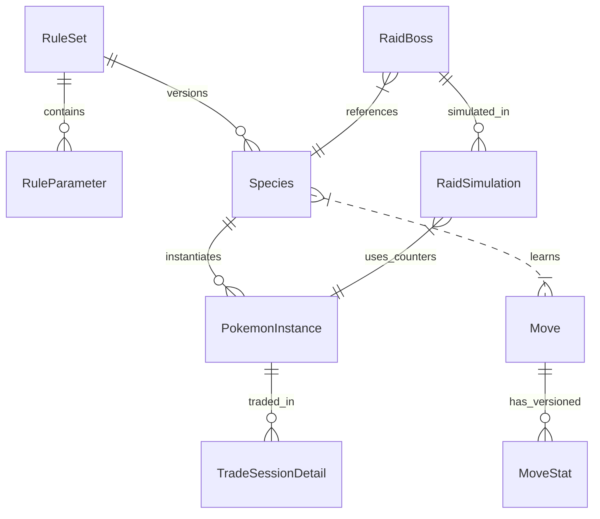

# Research Pack v1 — Reporte de Investigación y Plan de Acción Post-MVP

**Proyecto:** Pogo-lab (Mecánicas, Matemáticas, Datos y Decisiones)  
**Fecha de Corte:** 2026-07-17  
**Autor:** Antigravity (Advanced Agentic Coding Group)  
**Estado:** Insumo de investigación (sin verificar)  

---

> ⚠️ **Mapa de investigación — NO es especificación verificada.** Este informe y los registros de esta carpeta fueron generados por un agente: los números, fórmulas y test vectors **no están verificados contra fuente primaria** y contienen errores conocidos (ver [README.md](README.md) → deuda de verificación). No implementes desde aquí. La fuente de verdad son las **fixtures del `engine/` calculadas a mano**, producidas en la compuerta de verificación de [../milestones/fase-2.md](../milestones/fase-2.md). (La [política de datos](data_policy.md) sí es normativa.)

## 1. Resumen Ejecutivo

Este reporte define la estrategia y el mapa técnico para expandir Pogo-lab desde su MVP (enfocado en intercambios, amistad y Pokémon Lucky) hacia una plataforma analítica completa que abarca el combate (PvE y PvP), capturas, eclosión de huevos, economía de recursos y Max Battles. 

### Dominios de Mayor Valor
1. **PvP (GO Battle League):** Es el nicho con mayor engagement y tráfico recurrente de usuarios hardcore. Optimizar el Stat Product y analizar matchups bajo caps de CP tiene alta demanda.
2. **Max Battles (Dynamax/Gigantamax):** Al ser una mecánica reciente e insuficientemente documentada en plataformas tradicionales, ofrece a Pogo-lab una ventana única de diferenciación.

### Fuentes Canónicas Clave
La fuente de verdad absoluta de datos brutos (stats base, movimientos, CPM) es el **Game Master** del juego, publicado abiertamente por la comunidad (PokeMiners, SRC002). Las fórmulas de combate y torneos están lideradas por el código de **PvPoke** (SRC003) para PvP, y las metodologías analíticas de **The Silph Road** (SRC004) para tasas de probabilidad.

### Principales Riesgos
- **Cambios Silenciosos (Shadow Nerfs/Buffs):** Niantic modifica frecuentemente tasas (ej. shiny odds, pools de huevos) sin aviso oficial.
- **Lagunas de Conocimiento Legal:** Los ToS de Niantic prohíben la ingeniería inversa del cliente, el uso de credenciales del jugador y la automatización/spoofing del juego; todo eso queda excluido. El enfoque de Pogo-lab es de **curación y ETL sobre información ya pública**: consumir datos y datasets que la comunidad ya publica (PokeMiners, PvPoke, archivos de Silph Road), los aportes voluntarios de los usuarios y, cuando aporte valor, scraping de trackers públicos y APIs de terceros **siempre que no sea abusivo** (respetar robots.txt y los ToS de cada fuente, rate-limits razonables, atribución y sin eludir controles de acceso). Sobre esa base se normaliza y se derivan análisis con procedencia explícita.

---

## 2. Taxonomía Completa de la Plataforma

El flujo conceptual de la plataforma es **Entender → Calcular → Registrar → Analizar → Decidir**. Las mecánicas y herramientas de optimización se estructuran jerárquicamente de la siguiente manera:

```
Pogo-lab Platform
├── Mechanics Lab (Entender y Calcular)
│   ├── Stats & CP (Base Stats MSG->GO, CPM, CP, HP)
│   ├── Combat Engine
│   │   ├── PvE Mode (0.5s ticks, Weave DPS, Breakpoints, Boss HP)
│   │   └── PvP Mode (Turns, CMP priority, Shields, Stat Stages)
│   ├── Encounter System (BCR/BFR, Medals, Throw math 2-r)
│   ├── Egg Pools & Rates (Egg rarity tiers, Candy/Stardust yield)
│   └── Max Battles (Max Moves, Dynamax meter, MP economy)
├── Decision Planner (Analizar y Decidir)
│   ├── Resource Optimizer (Stardust/Candy path, Shadow vs Purified)
│   ├── Trade Tracker & Analyzer (Uniformity and independence tests)
│   ├── Raid Team Builder & Estimator (Solo/Duo viability, Dodge ROI)
│   └── PvP Team Builder (Coverage analysis, CMP tie matrix)
└── Community Hub (Registrar y Compartir)
    ├── Anonymous Contribution Panel (DatasetVersion builds)
    └── Statistical Validation Tools (Exact Binomial, Wilson tests)
```

---

## 3. Matriz de Cobertura

La siguiente matriz evalúa la viabilidad y confianza de cada dominio para su próxima implementación:

| Dominio | Confianza Matemática | Disponibilidad de Datos | Tipo de Evidencia | Idioma / Cobertura de Fuentes | Prioridad |
|---|---|---|---|---|---|
| **Estadísticas y CP** | Máxima (100% Exacto) | Completa (Game Master) | Oficial / Inferencia | Excelente (Bulbapedia/Game Master) | **Crítica** (Base) |
| **Intercambios & Lucky** | Alta (Probabilidades) | Alta (Muestras n>100k) | Comunitaria | Excelente (Silph Road/MVP) | **MVP** (Completado) |
| **Combate PvP** | Alta (Determinista) | Completa (Movesets) | Datamining / Código | Excelente (PvPoke MIT) | **Fase 2** |
| **Combate PvE** | Media (Lag de red) | Completa (Roster Boss) | Datamining / Heurística | Excelente (Gamepress Spreadsheet) | **Fase 2** |
| **Captura & Huida** | Alta (Fórmula 2-r) | Completa (BCR/BFR) | Datamining / Muestreo | Alta (Silph Road Science) | **Fase 2** |
| **Recursos (Power-Up)** | Máxima (Tablas de coste)| Completa (Game Master) | Oficial | Excelente (Game Master) | **Fase 2** |
| **Huevos & Shiny** | Media (Ratios ocultos) | Limitada (Eventos) | Muestreo comunitario | Media (Silph Research Discord) | **Fase 3** |
| **Max Battles** | Media (Mecánica nueva) | Parcial (Costos MP) | Datamining / Observación| Baja-Media (Wikis, Reddit) | **Fase 3** |

---

## 4. Auditoría de Herramientas Existentes

Consulte el archivo detallado en [tool_audit.csv](file:///home/carlos/VS_Code_Projects/products/Pogo-lab/docs/research/tool_audit.csv). A modo de resumen:

- **PvPoke:** Su simulación de turnos es la referencia mundial, pero carece de i18n al español e integración con el historial de capturas o intercambios del usuario.
- **Poké Genie:** Excelente UX móvil para escaneo visual (OCR), pero sus fórmulas internas de estimación de daño PvE son cerradas y a menudo simplistas.
- **GamePress:** Posee el mejor Spreadsheet de DPS/TDO (ER rating), pero el sitio web sufre de abandono técnico y anuncios invasivos.

**Valor Diferencial de Pogo-lab:** Ofrecer una suite abierta, localizada al español neutral, donde el usuario puede registrar sus propios datos (intercambios/capturas) e interactuar con simuladores deterministas transparentes y sin publicidad.

---

## 5. Registro de Fórmulas y Datasets

Las fórmulas matemáticas clave se detallan en [formula_registry.csv](file:///home/carlos/VS_Code_Projects/products/Pogo-lab/docs/research/formula_registry.csv). Entre ellas:
- **CP:** CP = $\max(10, \lfloor (Atk_{eff} \times \sqrt{Def_{eff}} \times \sqrt{Stam_{eff}} \times CPM^2) / 10 \rfloor)$.
- **Captura:** $P_{catch} = 1 - (1 - \frac{BCR}{2 \times CPM})^{Multiplier}$.
- **Daño PvP:** $Damage = \lfloor 0.5 \times Power \times \frac{Atk_{eff}}{Def_{eff}} \times STAB \times Effect \times 1.3 \times Shadow \rfloor + 1$.

Los datasets e inventarios requeridos están mapeados en [dataset_registry.csv](file:///home/carlos/VS_Code_Projects/products/Pogo-lab/docs/research/dataset_registry.csv), siendo el principal el **Game Master** estructurado por especies y CPM.

---

## 6. Backlog de Calculadoras

Consulte el registro de 30 calculadoras detallado en [calculator_backlog.csv](file:///home/carlos/VS_Code_Projects/products/Pogo-lab/docs/research/calculator_backlog.csv). Las calculadoras se han priorizado aplicando la matriz de pesos del plan original:
- *Utilidad práctica (20%), Demanda probable (15%), Evergreen (15%), Reutilización global (10%), Disponibilidad de datos (10%), Confianza matemática (10%), Diferenciación (10%), Facilidad (5%), Recurrencia (5%).*

---

## 7. Top 10 de Módulos Iniciales para la Fase 2

Para avanzar de forma estructurada en la siguiente fase de desarrollo, priorizaremos los siguientes 10 módulos:

### 1. CP & Level Projections (ID: CALC003)
- **Problema:** El usuario quiere saber los stats exactos y el CP de una especie a cierto nivel.
- **Audiencia:** Jugadores casuales y hardcore.
- **Fórmulas:** CP y HP base (FOR006 / FOR007).
- **Datos:** Game Master (Base Stats + CPM).
- **Dificultad:** Baja | **Valor:** Alto | **Riesgo:** Nulo.
- **Razón de prioridad:** Es el cimiento para todas las calculadoras avanzadas.

### 2. PvP Stat Product & IV Ranker (ID: CALC009)
- **Problema:** Encontrar qué combinación de IVs de un Pokémon maximiza sus estadísticas bajo los topes de 1500 CP o 2500 CP.
- **Audiencia:** Jugadores competitivos de GBL.
- **Fórmulas:** Stat Product = $Atk_{eff} \times Def_{eff} \times Stam_{eff}$.
- **Datos:** Game Master y tabla de CPM.
- **Dificultad:** Baja-Media (requiere iterar las 4096 combinaciones de IVs).
- **Valor:** Máximo (Principal motor de tráfico en herramientas PvP).

### 3. Power-Up Resource Calculator (ID: CALC006)
- **Problema:** Calcular Polvos y Caramelos/XL necesarios para subir niveles, considerando descuentos por Lucky o incremento por Shadow.
- **Audiencia:** Todo tipo de jugadores.
- **Fórmulas:** Costo acumulado por tramos de nivel.
- **Datos:** Tabla de costos de power-up.
- **Dificultad:** Baja | **Valor:** Alto | **Riesgo:** Nulo.

### 4. Catch Probability Slider (ID: CALC012)
- **Problema:** Estimar la probabilidad de captura según el tipo de bola, baya, tiro y medallas del jugador.
- **Audiencia:** Jugadores de incursiones y coleccionistas.
- **Fórmulas:** Catch Probability (FOR008) y Multiplicador continuo de tiro (2 - r).
- **Datos:** BCR/BFR de especies salvajes.
- **Dificultad:** Baja-Media | **Valor:** Alto | **Riesgo:** Bajo.

### 5. PvE Breakpoint Finder (ID: CALC007)
- **Problema:** Saber el IV de ataque y nivel exacto para que el ataque rápido aumente su daño contra un Raid Boss específico.
- **Audiencia:** Jugadores hardcore de incursiones.
- **Fórmulas:** Daño PvE (FOR010).
- **Datos:** Stats de especies, movimientos PvE y multiplicadores de Boss.
- **Dificultad:** Media | **Valor:** Alto.

### 6. Shadow vs Purified Advisor (ID: CALC019)
- **Problema:** Decidir si purificar un Pokémon oscuro evaluando el delta de daño (+20% Shadow vs +2 en IVs) y los recursos ahorrados.
- **Audiencia:** Jugadores que gestionan inventario de incursiones.
- **Fórmulas:** Comparación de TDO y CP final.
- **Datos:** Stats base y costos de purificación.
- **Dificultad:** Media | **Valor:** Alto.

### 7. Type Effectiveness Interactive Matrix (ID: CALC027)
- **Problema:** Visualizar de forma rápida las debilidades y resistencias de Pokémon con doble tipo.
- **Audiencia:** Jugadores casuales y principiantes en PvP/PvE.
- **Fórmulas:** Multiplicación matricial de efectividad de tipos.
- **Datos:** Tabla de efectividades de tipos de Pokémon.
- **Dificultad:** Baja | **Valor:** Medio-Alto.

### 8. Shiny Drought / Confidence Estimator (ID: CALC014)
- **Problema:** Calcular cuántos encuentros se necesitan para tener confianza de obtener un shiny o verificar si una "sequía" es matemáticamente anómala.
- **Audiencia:** Cazadores de Shinys.
- **Fórmulas:** Distribución geométrica acumulada.
- **Datos:** Base de datos de shiny odds por especie.
- **Dificultad:** Baja | **Valor:** Alto.

### 9. Elite TM Upgrade Matrix (ID: CALC020)
- **Problema:** Decidir qué Pokémon de mi inventario se beneficia más al gastar una MT Élite Rápida o Cargada.
- **Audiencia:** Jugadores avanzados.
- **Fórmulas:** Delta de DPS/TDO entre el moveset legacy y el normal.
- **Datos:** Base de datos de movimientos exclusivos.
- **Dificultad:** Media | **Valor:** Alto.

### 10. Max Move Upgrade Cost Estimator (ID: CALC015)
- **Problema:** Estimar las Partículas Max y Caramelos para subir Max Moves.
- **Audiencia:** Todo tipo de jugadores activos en Power Spots.
- **Fórmulas:** Costo acumulado por grupo de especie Dynamax.
- **Datos:** Tabla de costos de Max Moves.
- **Dificultad:** Baja | **Valor:** Alto.

---

## 8. Discrepancias y Experimentos Comunitarios

Las discrepancias detectadas se describen en [discrepancy_log.csv](file:///home/carlos/VS_Code_Projects/products/Pogo-lab/docs/research/discrepancy_log.csv). La más crítica a nivel de backend es la discretización por ticks de 0.5s en combates PvE, que invalida los cálculos puramente continuos de DPS y requiere un motor de simulación discreto.

Para resolver estas discrepancias, se han detallado 10 experimentos en [experiment_backlog.csv](file:///home/carlos/VS_Code_Projects/products/Pogo-lab/docs/research/experiment_backlog.csv), destacando la investigación de la carga del medidor Dynamax en Max Battles (EXP005) y la validación empírica del multiplicador lineal $2-r$ (EXP007).

---

## 9. Modelo de Datos Conceptual (Fase 2)

Para soportar las nuevas calculadoras y el registro de especies/movimientos, ampliaremos el esquema relacional con las siguientes entidades:



### Entidades Nuevas Clave
1. **`Species`:** Stats base (`atk`, `def`, `stam`), BCR, BFR, tipos (1 y 2), y grupo de coste Max.
2. **`Move`:** Movimientos de combate salvaje, PvE, PvP y Max.
3. **`MoveStat`:** Versión inmutable de los stats del movimiento (daño, energía, turnos) para mantener la reproducibilidad histórica.
4. **`RaidBoss`:** Jefe de incursión activo, tier, HP y CPM del Boss.

---

## 10. API Conceptual

Para alimentar los componentes del frontend mediante HTMX y JS ligero:

### 1. CP & Stats
- **Endpoint:** `GET /api/v1/mechanics/cp-calculator/`
- **Params:** `species_id` (string), `level` (float), `atk_iv` (int), `def_iv` (int), `stam_iv` (int).
- **Response:**
```json
{
  "cp": 4178,
  "hp": 180,
  "atk_effective": 315.0,
  "def_effective": 197.0,
  "stam_effective": 229.0,
  "cpm": 0.7903,
  "nerf_applied": true
}
```

### 2. PvP Rankings
- **Endpoint:** `GET /api/v1/pvp/rankings/`
- **Params:** `species_id` (string), `league` (great|ultra|little), `atk_iv` (int), `def_iv` (int), `stam_iv` (int).
- **Response:**
```json
{
  "rank": 1,
  "ivs": {"atk": 0, "def": 15, "stam": 15},
  "cp_optimal": 1499,
  "level_optimal": 24.5,
  "stat_product": 2275548,
  "stat_product_percentage": 100.0,
  "current_specimen": {
    "rank": 342,
    "cp": 1492,
    "stat_product_percentage": 97.4
  }
}
```

---

## 11. Test Vectors de Referencia (Math Suite)

Consulte el archivo [test_vectors.json](file:///home/carlos/VS_Code_Projects/products/Pogo-lab/docs/research/test_vectors.json) para contrastar los resultados numéricos exactos de las pruebas de CP, HP, probabilidad de captura, daño PvE y PvP. Estos vectores garantizan que las implementaciones en Python coincidan al decimal con el motor oficial del juego.

---

## 12. Research Debt (Incertidumbres No Resueltas)

1. **Mecánica Exacta de Gigantamax:** Aún no se han documentado con rigor científico los multiplicadores de daño ni las tasas de captura base de los jefes Gigantamax en Power Spots.
2. **Shiny Rates Dinámicos:** Existe la sospecha de que Niantic ajusta dinámicamente la tasa shiny a nivel de cuenta según la inactividad del jugador, pero no hay muestra estadística robusta que descarte sesgo de confirmación.
3. **Decaimiento de Rutas:** Las tasas de aparición de células Zygarde y spawns específicos de rutas sufren de alta opacidad en la recopilación comunitaria debido a fallos de localización GPS.

---

## 13. Paquetes para Investigaciones de Dominio

Se han generado guías individuales detalladas en la carpeta [domain_research_packets/](file:///home/carlos/VS_Code_Projects/products/Pogo-lab/docs/research/domain_research_packets/) para los siguientes dominios:
- [PvE Combat & Raids](file:///home/carlos/VS_Code_Projects/products/Pogo-lab/docs/research/domain_research_packets/pve_combat.md)
- [PvP Combat & Rankings](file:///home/carlos/VS_Code_Projects/products/Pogo-lab/docs/research/domain_research_packets/pvp_combat.md)
- [Capture Mechanics](file:///home/carlos/VS_Code_Projects/products/Pogo-lab/docs/research/domain_research_packets/capture_mechanics.md)
- [Max Battles & Dynamax](file:///home/carlos/VS_Code_Projects/products/Pogo-lab/docs/research/domain_research_packets/max_battles.md)
- [Eggs & Shiny Odds](file:///home/carlos/VS_Code_Projects/products/Pogo-lab/docs/research/domain_research_packets/eggs_and_shiny.md)
- [Resource Economy](file:///home/carlos/VS_Code_Projects/products/Pogo-lab/docs/research/domain_research_packets/resources_economy.md)
